# oci-helper 🐢

[](https://komarev.com/ghpvc/?username=Yohann0617&color=green&label=visitors)
[](LICENSE)
[](https://openjdk.org/projects/jdk/21)
[](https://spring.io/projects/spring-boot)
[](https://maven.apache.org)
[](https://vuejs.org)
[](https://www.docker.com)
[](https://github.com/Yohann0617/oci-helper/stargazers)
[](https://github.com/Yohann0617/oci-helper/issues)


> 一个基于 Oracle OCI SDK 🐢 开发的 web 端可视化甲骨文云助手（Y探长），目前实现的功能有：批量添加多个租户配置、更改实例配置以及引导卷配置、附加ipv6、一键开启免费AMD实例下行500Mbps、一键自动救援/缩小硬盘（默认47GB）、一键自动更新、安全列表、实时流量查询（分钟级别）、根据多个 CIDR 网段更换实例公共IP、多租户同时批量抢机、Cloud Shell、断点续抢、备份恢复、日志实时查看、消息通知、MFA登录验证、更新 Cloudflare DNS 记录、TG 机器人操作、IP信息查询、全球服务器地图等功能。

## 🔔注意事项及免责声明

- ⚠️因开机、换IP频率过高而导致的封号本人概不负责。
- ❤️开发此项目纯属个人爱好，无后门，放心使用。
- 🔒强烈建议不要裸HTTP访问，应使用Nginx反向代理配置HTTPS访问。
- 🔐建议使用密钥登录服务器，防止服务器被SSH爆破导致API数据及密钥泄露。
- 📃记得定时清理docker日志~

## ⚙核心功能

1. 支持同时**批量添加**多个租户配置信息，所有分页列表都支持**模糊搜索**、**状态筛选**。
2. 支持更改实例配置、引导卷配置、一键附加ipv6、一键放行所有端口、实例列表、引导卷列表、**一键开启免费AMD实例下行500Mbps**、**一键自动救援/缩小硬盘（默认47GB）**、**安全列表**、**实时流量统计**（分钟级别）、一键自动更新等功能。⭐⭐
3. 根据多个**CIDR网段**更换实例公共IP，遇到请求频繁等异常会直接忽略，不影响下一次执行，直至更换到指定IP段的IP。支持**更换IP后自动更新 Cloudflare DNS** 记录功能。⭐⭐
4. 多租户**同时批量开机**，后台一直运行，直至开机成功。⭐
5. 支持**断点续抢**，配置以及抢机任务都保存在本地数据库，服务重启会继续执行抢机任务，无需重复配置。⭐⭐
6. 支持多区号（配置项以region区分），例：我有一个4区号，则新增4个配置，修改region即可，其他配置项都一样。
7. 支持前端页面**实时查看后端日志**。
8. 支持**加密备份恢复**，实现无缝数据迁移，方便快捷。⭐⭐
9. 支持**MFA**登录验证功能（不是龟壳的，是我这个面板的登录），保证服务的安全性。
10. 支持分页查询、添加、更新、删除 **Cloudflare** 多个域名的 DNS 记录。⭐
11. 支持 **Telegram 机器人**简单操作，服务成功部署后向机器人发送`/start`选择操作。
12. 支持类似于甲骨文云 **Cloud Shell** 控制台功能，方便使用 netboot 救砖。⭐⭐
13. 支持IP信息查询（部署成功后访问 http://ip:8818/ip-info ）以及首页显示全球服务器地图（可精确到街道的店铺），点亮全球。

## 💻一键 docker-compose 部署或更新

```bash
bash <(wget -qO- https://github.com/Yohann0617/oci-helper/releases/latest/download/sh_oci-helper_install.sh)
```
> 此命令也可以用于更新镜像并重启容器，不会删除已有的配置。

- 🔔 安装完成后浏览器直接访问 `http://ip:8818` 即可访问（建议之后通过https访问），账号密码可通过脚本进行修改。
如需自己手动修改账号密码，更改 `/app/oci-helper/application.yml` 中的配置并执行 `docker restart oci-helper` 重启docker容器即可。
- 📃 如需查看完整日志，执行：`docker logs oci-helper  >>  /app/oci-helper/oci-helper.log` 导出日志文件自行查看。

🎄 部署完成后，`/app/oci-helper`的目录结构如下：
```bash
root@yohann:/app/oci-helper# tree
.
├── keys                            # 是一个目录，存放所有的pem秘钥文件
├── application.yml                 # 项目配置文件，如需更改网页账号密码在此处更改，并执行 docker restart oci-helper 重启容器
├── docker-compose.yml              # docker-compose部署所需配置文件
├── oci-helper.db                   # 项目数据库文件
└── update_version_trigger.flag     # 注意是一个文件，不是目录，用于版本自动更新
````

### 📃更新日志

> 1. 2025年07月08日——新增一键升级功能，首次更新时**需要先删除**旧的`docker-compose.yml`文件，再执行一键脚本。如有将部署脚本下载到本地的用户也需要重新下载。具体参考releases中v3.0.1版本要求。
> 2. 2025年07月04日——升级了部分依赖以及SDK，首次更新时**需要先删除**旧的`application.yml`文件，再执行一键脚本。具体参考releases中v3.0.0版本要求。
> 3. 2025年06月04日——新增了支持 Cloud Shell 控制台功能，更新之前**需要先删除**旧的`docker-compose.yml`文件，再执行一键脚本。
> 4. 2024年11月30日——数据库新增了一张表，TG、钉钉消息通知都改成了在web页面配置，如遇到配置异常，请删除`application.yml`文件，然后重新执行一键命令，修改自定义的账号密码，`docker restart oci-helper`重启容器即可。

### 🌏Nginx反向代理

> 如果**需要配置HTTPS**，又想要 VNC 连接救砖，必须按照以下配置

<details>
    <summary> ☜ 点击查看 👨‍💻</summary>

#### 1. 修改 docker-compose.yaml
> 这一步是保证服务端口只有服务器内部网络可以访问，外部无法直接通过IP+端口的方式访问服务，提高安全性。修改完之后需要执行 `cd /app/oci-helper && docker-compose down && docker-compose up -d` 重启服务或者直接再执行一次一键脚本。

`/app/oci-helper/docker-compose.yaml`：
```yaml
services:
  watcher:
    image: ghcr.io/yohann0617/oci-helper-watcher:main
    container_name: oci-helper-watcher
    restart: always
    volumes:
      - /var/run/docker.sock:/var/run/docker.sock
      - /usr/local/bin/docker-compose:/usr/local/bin/docker-compose
      - /app/oci-helper/docker-compose.yml:/app/oci-helper/docker-compose.yml
      - /app/oci-helper/update_version_trigger.flag:/app/oci-helper/update_version_trigger.flag
      - /app/oci-helper/oci-helper.db:/app/oci-helper/oci-helper.db

  oci-helper:
    image: ghcr.io/yohann0617/oci-helper:master
    container_name: oci-helper
    restart: always
    ports:
      - "127.0.0.1:8818:8818" # 修改项
    volumes:
      - /app/oci-helper/application.yml:/app/oci-helper/application.yml
      - /app/oci-helper/oci-helper.db:/app/oci-helper/oci-helper.db
      - /app/oci-helper/keys:/app/oci-helper/keys
      - /app/oci-helper/update_version_trigger.flag:/app/oci-helper/update_version_trigger.flag
    networks:
      - app-network
      
  websockify:
    image: ghcr.io/yohann0617/oci-helper-websockify:master
    container_name: websockify
    restart: always
    ports:
      - "127.0.0.1:6080:6080" # 修改项
    depends_on:
      - oci-helper
    networks:
      - app-network

networks:
  app-network:
    driver: bridge
```

#### 2. Nginx反向代理核心示例
> 修改完记得重启Nginx

```nginx
        location /myvnc/ {
            proxy_pass http://127.0.0.1:6080/;
            proxy_http_version 1.1;
            proxy_set_header Upgrade $http_upgrade;
            proxy_set_header Connection "upgrade";
            proxy_set_header Host $host;
            send_timeout 10800;
            proxy_read_timeout 10800;
            proxy_send_timeout 10800;
        }

        location / {
            add_header Cache-Control no-cache;
            proxy_pass http://127.0.0.1:8818;
            proxy_set_header Host $host;
            proxy_set_header X-Real-IP $remote_addr;
            proxy_set_header X-Forwarded-For $proxy_add_x_forwarded_for;
            proxy_set_header X-Forwarded-Proto $scheme;
            proxy_http_version 1.1;
            proxy_set_header Upgrade $http_upgrade;
            proxy_set_header Connection 'upgrade';
            send_timeout 10800;
            proxy_read_timeout 10800;
            proxy_send_timeout 10800;
        }
```

</details>

## 👶手动部署（不推荐）

<details>
    <summary> ☜ 点击查看 👨‍💻</summary>

### 1. 新建目录

创建密钥文件存放目录`/app/oci-helper/keys`。

```bash
mkdir -p /app/oci-helper/keys && cd /app/oci-helper
```

### 2. 下载文件

下载 [Releases](https://github.com/Yohann0617/oci-helper/releases/tag/deploy) 中的`application.yml`、`oci-helper.db`、`docker-compose.yml`以及**最新 Release 版本**的`sh_oci-helper_install.sh`这4个文件到`/app/oci-helper`目录下，并修改`application.yml`部分配置。
`sh_oci-helper_install.sh`是部署脚本，可自行修改内容，执行之前记得先`chmod +x /app/oci-helper/sh_oci-helper_install.sh`。

### 3. docker-compose 部署或更新

```bash
chmod +x /app/oci-helper/sh_oci-helper_install.sh && cd /app/oci-helper && ./sh_oci-helper_install.sh
```

> 此脚本也可以用于更新镜像并重启容器，不会删除已有的配置。

</details>

## 🔍页面展示

> 部署脚本


> 部署在1C1G机器上运行一个月后资源占用情况


> 主页

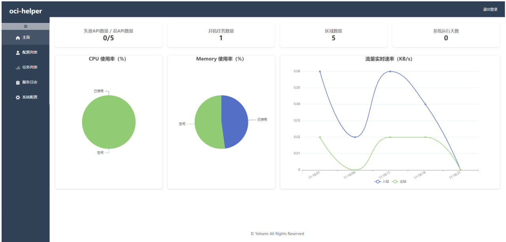

> 新增配置

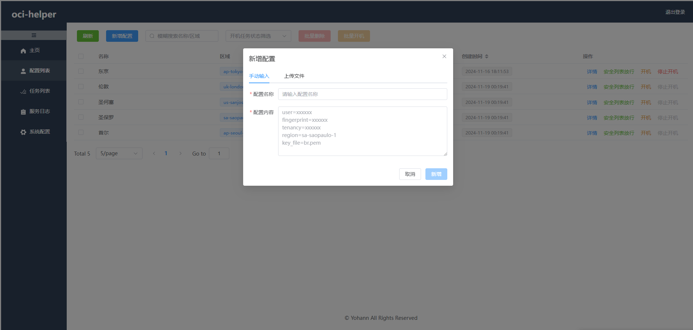

> 更换IP并自动更新 Cloudflare 域名 DNS 记录

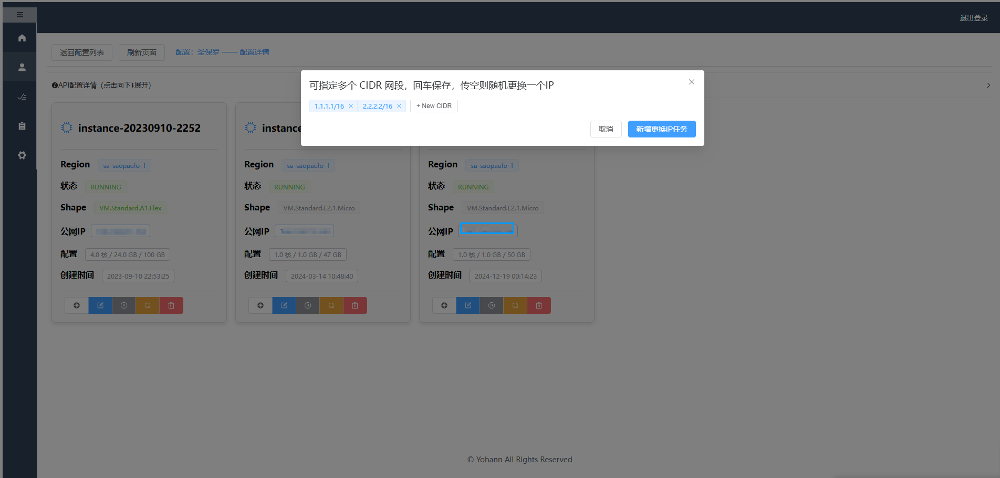

> 编辑实例

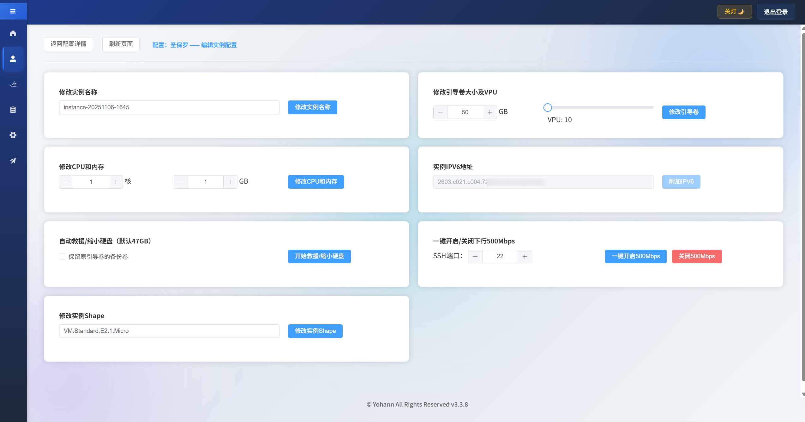

> TG操作


<details>
    <summary> ☜ 点击查看更多 👨‍💻</summary>

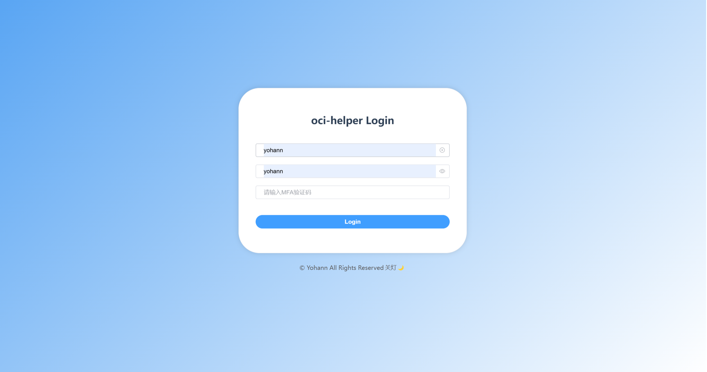

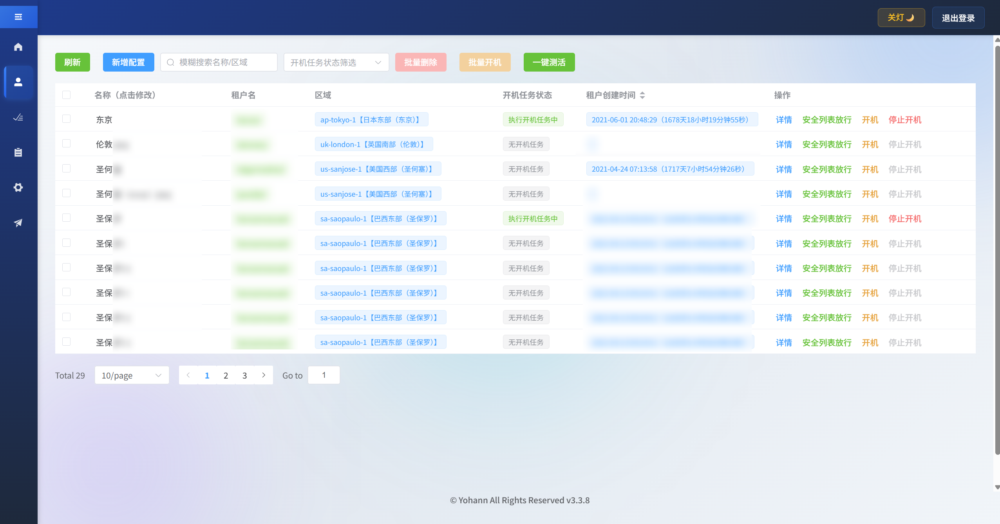
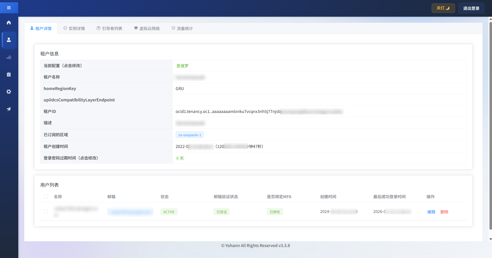

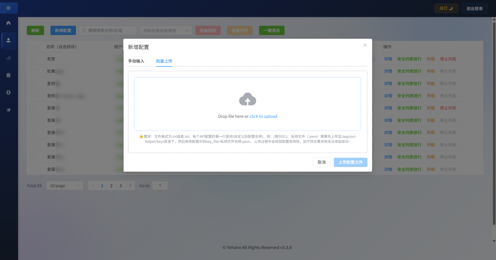
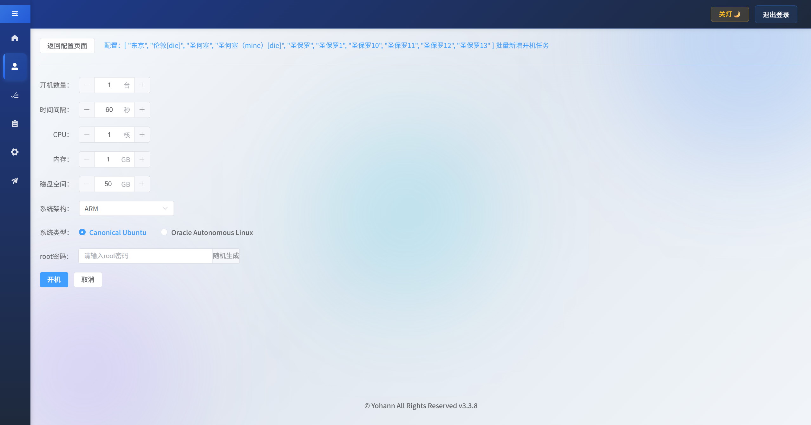


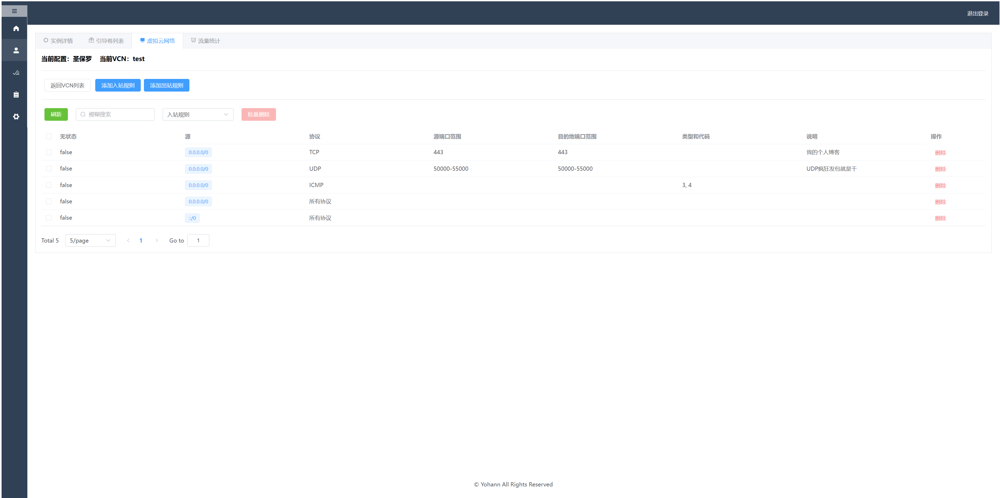
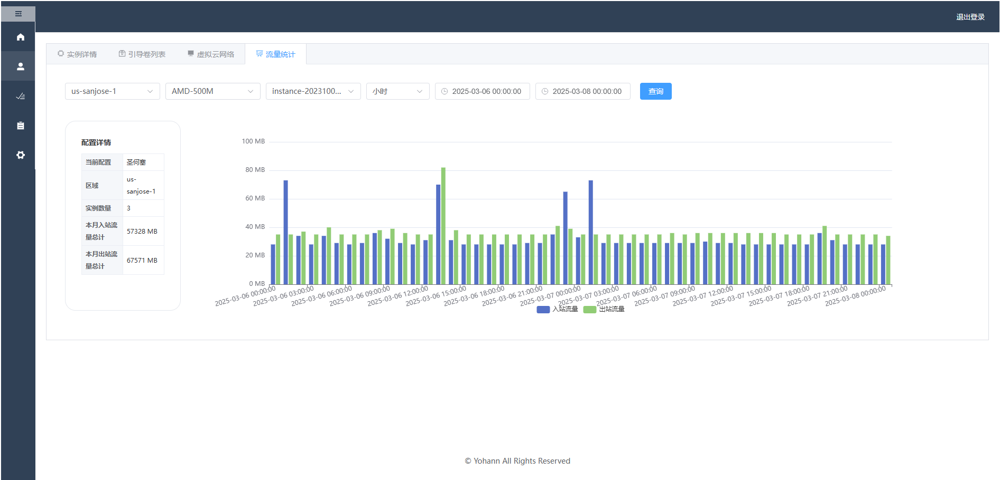
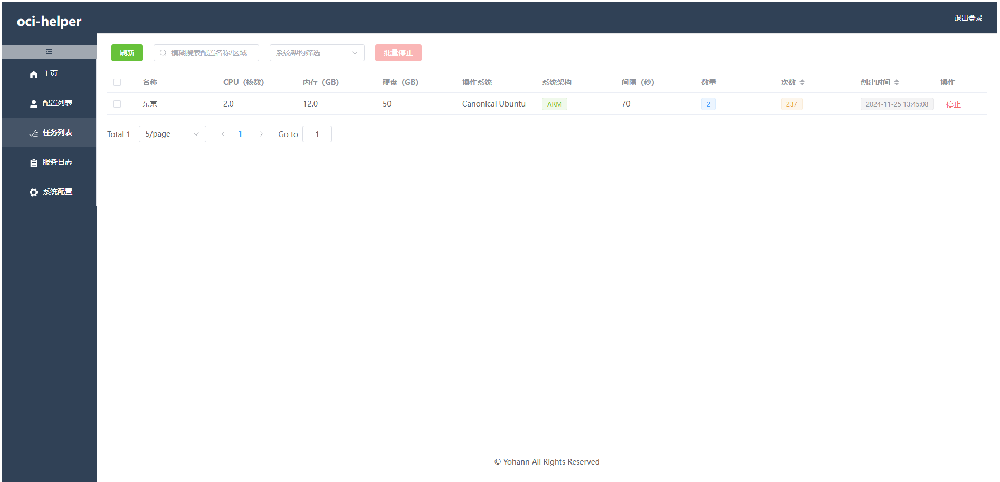
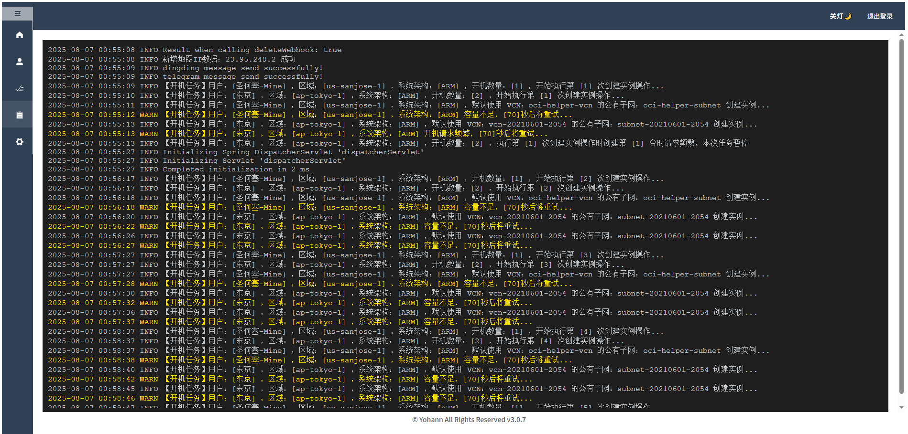
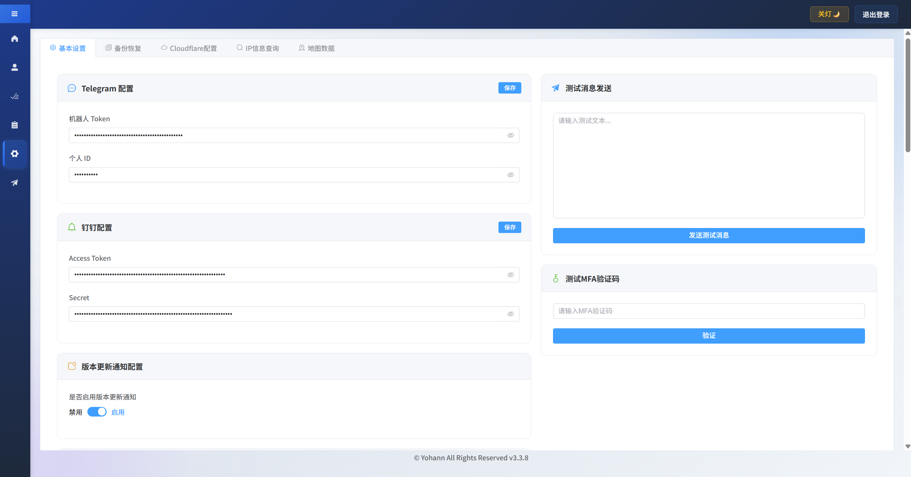

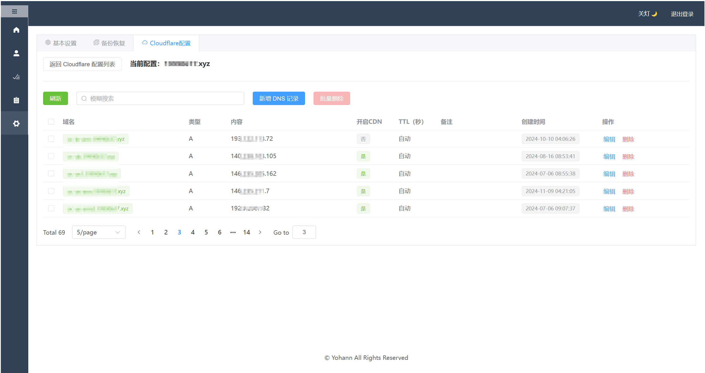


</details>

## ⭐Stargazers over time

[](https://starchart.cc/Yohann0617/oci-helper)

## 🙏 特别鸣谢

<p align="left">
  <a href="https://dartnode.com" title="Powered by DartNode - Free VPS for Open Source"></a>
  <a href="https://zmto.com" title="Powered by ZMTO"></a>
  <a href="https://yxvm.com/" title="Powered by YxVM"></a>
  <a href="https://www.nodeseek.com/" title="Powered by NodeSeek"></a>
</p>


